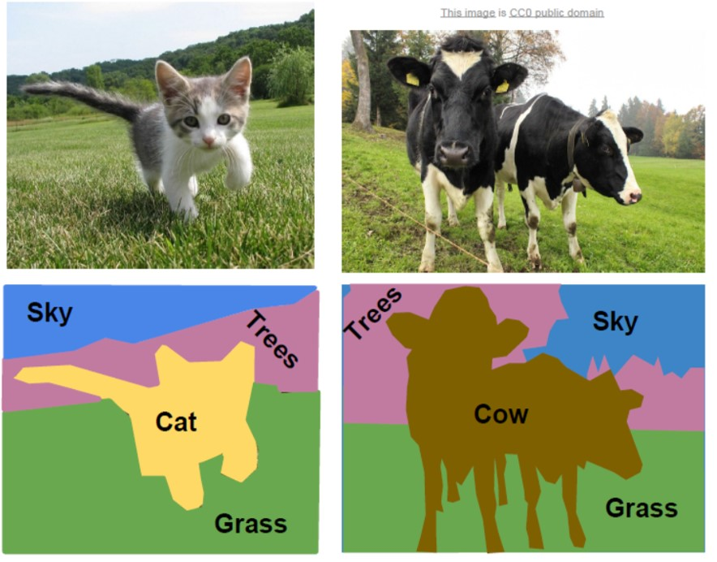
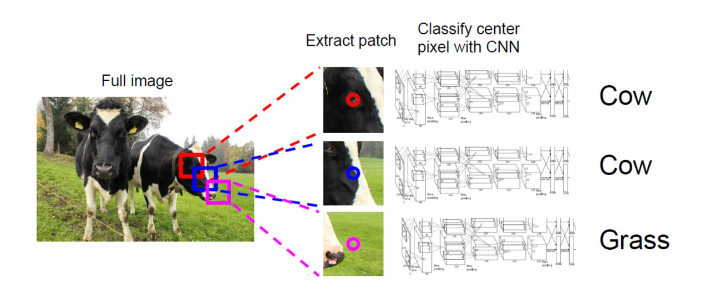
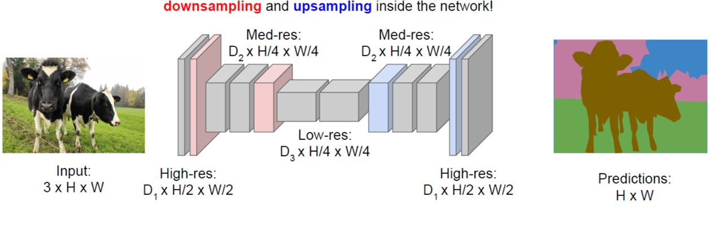
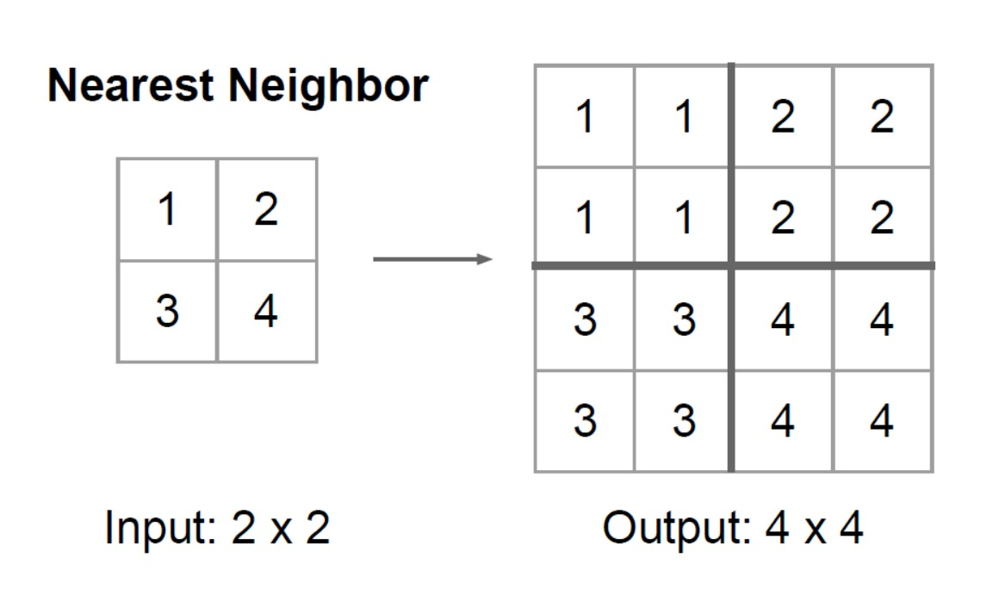
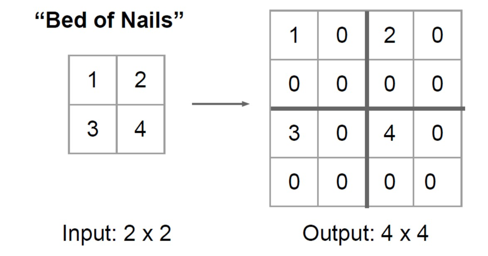
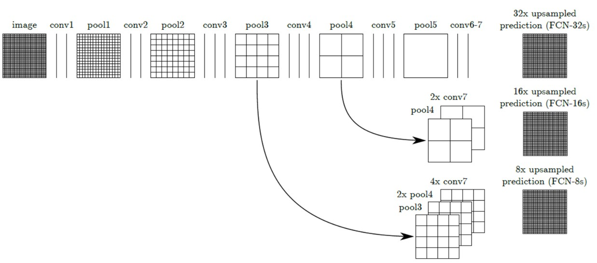
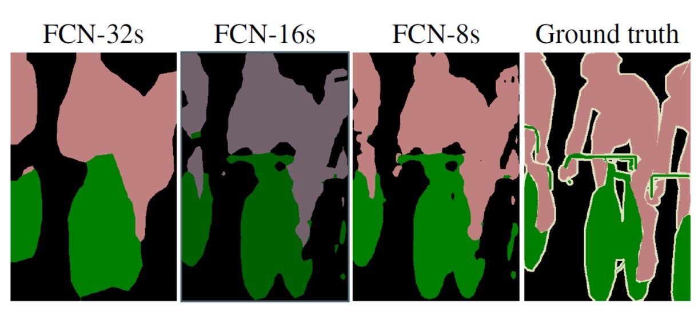
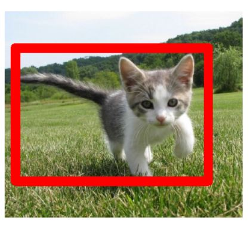
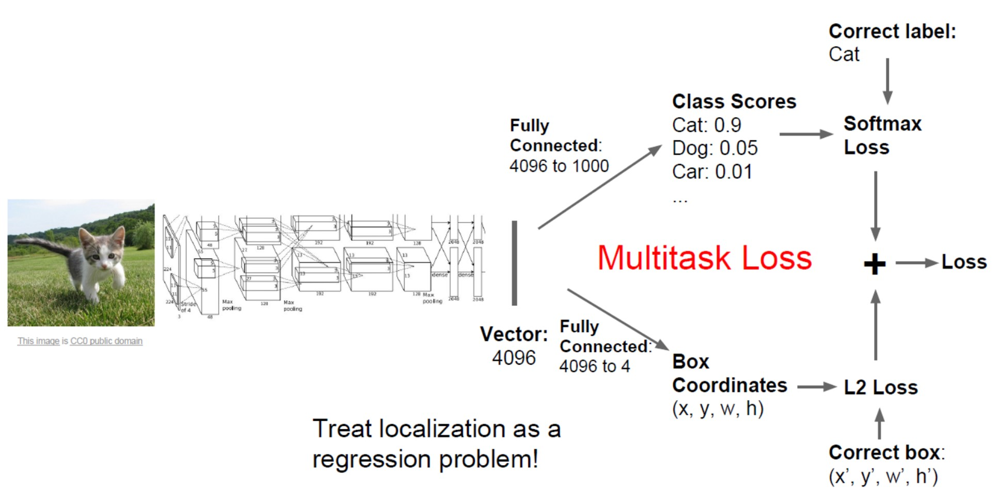

# 图像检测和分割

图像的检测和分割在计算机视觉中是一块非常重要的领域，它主要可以分为以下四块内容，分别是语义分割（Semantic Segmentation）、分类和定位（Classification  and  Localization）、目标检测（Object Detection）和实例分割（Instance Segmentation）。

## 语义分割

语义分割的目标是对与图像中所有的像素点分配给其对应的标签，语义分割和实例分割的最主要区别在于语义分割只是关注每个像素所属的类别，而不是关心起具体内容实例。如下面右边的图所示，语义分割对于草地上的两头牛只关心其属于类别为“Cow”，而不是区分其中每个牛的不同个体。

那么最简单的语义分割思想如下图所示，我们对输入图像中的每个像素点，以其中心提取图像块Patch，对每个Patch送入CNN中进行图像分类得到对应的标签，在这里我们还是采用的CNN网络可以是Alex-Net，VGG-Net等等，得到的Label对应Patch中心像素，然后在图像的所有的像素点上进行上述操作，即可得到所有像素的所对应的Label，所以分割问题就变成了一个图像分类的问题。

但是这么做的最大的一个问题就是效率低下，需要大量的计算资源，因此上述简单的方法在实际中是不实用的。在实际处理语义分割问题我们一般是采用全卷积神经网络（Fully Convolutional Network，简称FCN）进行处理的。FCN是2015发表在CVPR上的一篇论文，提出了全卷积神经网络的概念，全卷积并不是一个新的概念，因为全连接层也可以看作是卷积层， 只不过是卷积核是原图大小而已。

### FCN和CNN

在一般的卷积神经网络当中，一般结构都是前几层是卷积层加池化，最后跟2-3层的全连接层，然而在全卷积神经网络当中，没有了全连接层，取而代之的是卷积层，如下图所示。

最后一层输出的是1000个二维数组，其中每一个数组可以可视化为一张图像，图中的每一个像素点的灰度值都代表当前像素点属于该类的概率，比如在这1000张图像中，取出其中代表tabby cat的概率图，颜色从蓝到红色，代表当前点属于该类的概率就越大。因此可以看出FCN和和一般的CNN的区别就是把最后几层的全连接层换成了卷积层，这样做的好处激素hi能够进行dense prediction，可以实现FCN对图像进行像素级别的分类，从而解决了语义级别的图像分类问题。与经典的的CNN在卷积层之后使用全连接层得到固定长度的特征向量进行分类（全连接层+softmax输出）不同，FCN可以接受任意尺寸的输入图像，采用反卷积层对最后一个卷积层的feature map进行上采样，使它恢复到输入图像相同的尺寸，从而对每个像素都产生了一个预测，同时保留了原始输入图像中的空间信息，最后在上采样的特征图中进行逐像素分类，整个FCN的操作过程如下图所示。

### 下采样和上采样

下采样（Downsampling）主要是对图片进行卷积操作之后进行的池化操作以及跨步卷积，相当于对图片进行有损压缩处理，比如VGG-16五次池化之后图片被缩小了32倍，为了得到和原图等大的分割图，我们需要进行上采样/反卷积。

在这里的上采样即是反卷积（Deconvolution）。当然关于这个名字不同框架不同，Caffe和Keras里面叫做Deconvolution，在tensorflow里面叫做conv_transpose。在CS231n这门课当中，称上采样为conv_transpose

更加合适。

反卷积和和卷积类似，都是相乘相加的运算。只不过后者是多对一，前者是一对多。而反卷积的前向和反向传播，只用颠倒卷积的前后向传播即可。所以无论优化还是反向传播算法都是没有问题，图解如下：

虽然在文中说是可学习的反卷积，但是作者实际代码中没有让它进行学习。

具体的上采样的方式主要有以下几种：

**1、Nearest Neighbor**

这种反卷积操作只是在反卷积之后这一块区域的值都填充和之前一样的值。

**2、Bed of Nails**

这种反卷积只是在固定的位置和原来的值相等，其余的位置均填充为0。

**3、Max Unpooling**

最大池化反卷积会记住在前面做最大池化时每个池中的最大值所在位置，在反卷积的时候将值填充到原本最大值所在的位置，其余的位置均填充为0。

​	**4、Transpose Convolution**

<table style="width:100%; table-layout:fixed;">
  <tr>
    <td></td>
    <td></td>
    <td></td>
    <td></td>
  </tr>
  <tr>
    <td>No padding, no strides, transposed</td>
    <td>Arbitrary padding, no strides, transposed</td>
    <td>Half padding, no strides, transposed</td>
    <td>Full padding, no strides, transposed</td>
  </tr>
  <tr>
    <td></td>
    <td></td>
    <td></td>
    <td></td>
  </tr>
  <tr>
    <td>No padding, strides, transposed</td>
    <td>Padding, strides, transposed</td>
    <td>Padding, strides, transposed (odd)</td>
    <td></td>
  </tr>
</table>

### 跳跃结构（skip architecture）

因为如果将全卷积之后的结果直接上采样得到的结果是非常粗糙的，所以作者将不同池化层的结果进行上采样之后来优化输出，具体结构如下图所示。

从不同上采样结构得到的结果对比如下图所示。

​当然，你也可以将pool1和pool2的输出在进行上采样进行输出，但是文中说这样做的对结果的提升并不是很好。

## 分类和定位

图像的分类和定位问题主要是给定一张只有一个对象的图片，我们所要做的任务就是判别图片中的对象具体是哪一类，同时我们也需要将该对象的位置给确定下来，如下图对猫进行定位所示。

很显然这个任务中的损失函数有两个，一个是判别猫产生的损失函数，即softmax loss，另一个损失函数是判别猫的位置而产生的损失函数，即L2 loss。因此我们可以把这个任务看作为多损失任务。其具体的结构如下图所示。

## 目标检测

### R-CNN

Region CNN(RCNN)可以说是利用深度学习进行目标检测的开山之作.作者[Ross Girshick](http://www.rossgirshick.info/)多次在PASCAL VOC的目标检测竞赛中折桂。

本文解决了目标检测中两个关键的问题。

**问题1、速度**

经典的目标检测算法使用滑动窗法依次判断所有可能的区域。本文则预先提取一系列较可能是物体的候选区域，之后仅在这些候选区域上提取特征，进行判断。

**问题2、训练集**

经典的目标检测算法在区域中提取人工设定的特征（[Haar](https://zh.wikipedia.org/wiki/%E5%93%88%E5%B0%94%E7%89%B9%E5%BE%81)，[HOG](https://zh.wikipedia.org/wiki/%E6%96%B9%E5%90%91%E6%A2%AF%E5%BA%A6%E7%9B%B4%E6%96%B9%E5%9B%BE)）。本文则需要训练深度网络进行特征提取。可供使用的有两个数据库： 
一个较大的识别库（[ImageNet ILSVC 2012](http://www.image-net.org/challenges/LSVRC/2012/)）：标定每张图片中物体的类别。一千万图像，1000类。 
一个较小的检测库（[PASCAL VOC 2007](http://host.robots.ox.ac.uk/pascal/VOC/voc2007/)）：标定每张图片中，物体的类别和位置。一万图像，20类。 
本文使用识别库进行预训练，而后用检测库调优参数。最后在检测库上评测。

**流程**

  <td>RCNN算法流程图</td>

1、对一张图像生成1K到2K的候选区域

2、对每隔候选区域，使用神经网络提取特征

3、特征送入每一类的SVM分类器，判别是否属于该类

4、使用回归器精细修正候选框的位置

## 实例分割